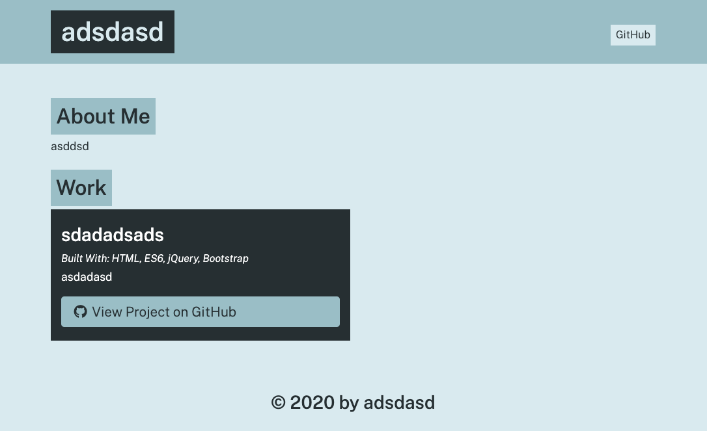

# David's Portfolio Generator
Dynamically create github portfolios with this fast and easy Portfolio Generator. Answer a couple of questions link your github page and respective projects and generate your own portfolio. 

## Functionality
You need to clone the repository to test this app and run it through terminal with command code "node app" from your cloned root folder.

Upon running the app you are presented with a series of questions that you have to answer before you can proceed.

1. "What is your name?"
    * Type name and enter.
2. "Enter your Github Username."
    * Type in your github username.
3. Prompted to enter information (see #2).
    * You will be prompted if you want to add a description about your self. And asked if Y/N.
    * If yes type Y and you'll be prompted with another area to type in your description.
    * If no type N and you'll be carried over to the next question.
4. "What is the name of your project?"
    * Type in project name.
5. "Provide a description of the project."
    * Type in a description of the project.
6. Prompted with a checkbox.
    * You will be prompted with a checkbox option to choose what your project is made of.
    * Use arrow keys to move through the options.
    * Press space to toggle through options 1 by 1.
    * Press a to toggle all.
    * Press i to invert selection.
7. "Enter the Github link to your projects."
    * Type in the github link of the project.
8. "Would you like to feature this project?"
    * You will be prompted if you want to feature the project
    * If yes type Y then your project will be featured.
    * If no type N then your project will not be featured.
9. You will be asked if you want to add another project.
    * If answered y you will be prompted with process starting from instruction #4
    * If answere n the website will be created.

## Created using
* HTML v5
* CSS v3
* JavaScript v1.8.5
* Node.js

## Link to Repository
https://github.com/daejo/portfolio-generator

## Contribution
Created by: 
* David Joaquin ([daejo](https://github.com/daejo)) 

## Screenshot
